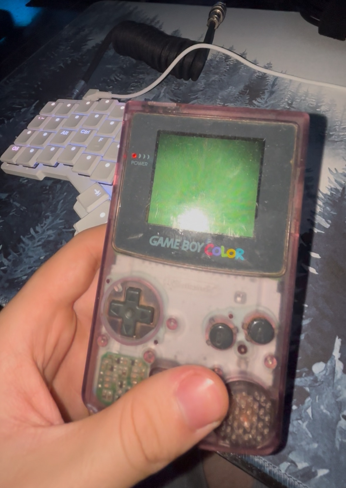

## IroGB test ROMs

To read through the source, see the original repository (the mirrors on my GitHub or libretro's GitLab should also suffice):
- https://kaze.moe/TismForge/IroGB/

All tests will be checked on a physical CGB model before release. Passing state is indicated by a green screen (see below), anything else denotes failure:
- 

### Test overview

| Test name | Tested behavior |
| --- | --- |
| `stop_mode_kills_div` | Tests the impacts of executing a STOP instruction on the timer module |

